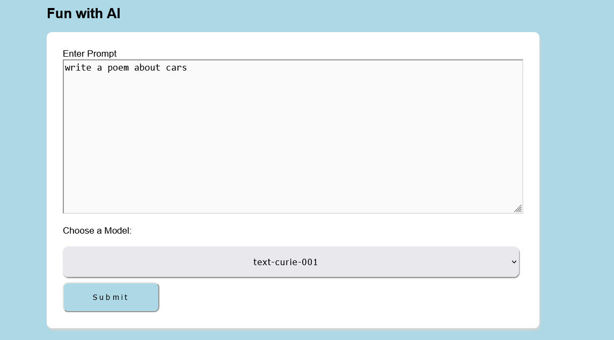
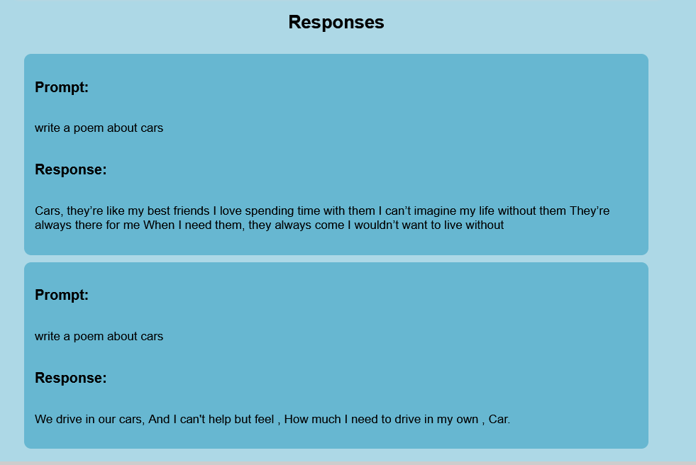

# Fun With GPT3

This project accepts text input where the user can write a prompt. The prompt is submitted to the openai API along with the selected model. The artifical intelligence model will generate a written response based on the provided text and sends it back to the application to be used.

The response from the API is displayed to the user in reverse chronological order. Additionally, the user can change which model is being used via the dropdown selector.

## Examples of the appliation
Displays how the form looks

Displays how the API responses will look

## Programming languages used

1. HTML
2. CSS
3. JavaScript

# Authors
Kevin Lucas
